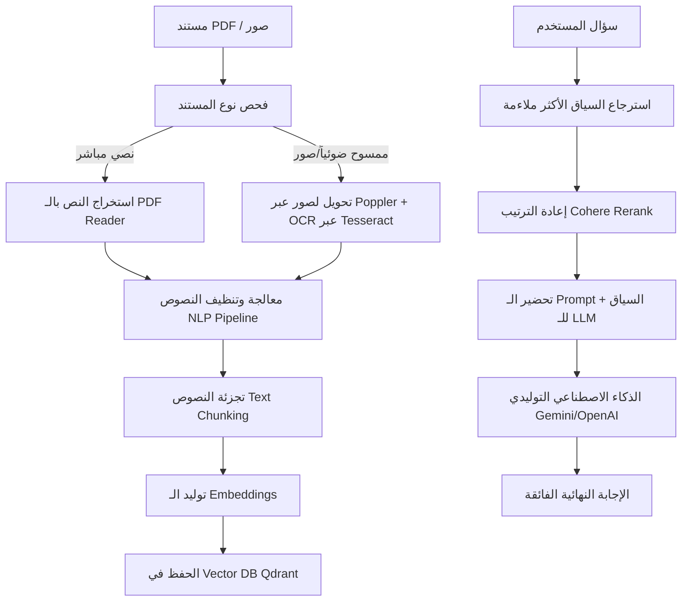

<<<<<<< HEAD
# 📄 Document AI Assistant (RAG + OCR)

---

## 👨‍💻 Developed by
**مازن خالد أحمد قحطان**  
*Graduation Project Portfolio | AI & NLP Specialist*

---

## 📌 Overview (نبذة عن المشروع)
نظام ذكي متكامل لتحليل ملفات **PDF** والدردشة التفاعلية معها باستخدام تقنيات توليد النصوص المستندة إلى الاسترجاع (**RAG**)، التعرف الضوئي على الحروف (**OCR**)، وتصنيف الكيانات المسماة (**NER**). 

يتميز النظام بقدرته الفائقة على معالجة الملفات النصية المطبوعة والمستندات الممسوحة ضوئياً (Scanned Documents) أو الصور، مع استخراج دقيق للمعلومات الجوهرية وتقديم إجابات موثوقة قليلة الهلوسة بفضل التحقق الدقيق من السياق.

---

## ⚙️ System Workflow (آلية عمل النظام)


---

## 🛠️ Tech Stack (التقنيات المستخدمة)

| التقنية (Technology) | الدور في المشروع (Role in Project) |
| :--- | :--- |
| **Streamlit** | واجهة مستخدم ويب تفاعلية فائقة السرعة وعصرية البصريات. |
| **LangChain** | إطار العمل الرئيسي لإدارة وتمرير سياق الـ **RAG Pipeline**. |
| **Qdrant** | قاعدة بيانات المتجهات (**Vector Database**) عالية الكفاءة لتخزين واسترجاع متجهات النصوص. |
| **Tesseract OCR + Poppler** | استخراج الكلمات والنصوص بدقة متناهية من الصور والملفات الممسوحة ضوئياً. |
| **OpenAI / Gemini APIs** | العقول المدبرة لتمثيل النماذج اللغوية الضخمة للرد والتحليل. |
| **Cohere Rerank** | إعادة ترتيب الوثائق المسترجعة لرفع دقة الإجابات وتقليل الهلوسة إلى الحد الأدنى. |

---

## 🚀 Features (مميزات النظام)
* **دعم شامل للمستندات:** يدعم ملفات PDF النصية الرقمية والمستندات الورقية الممسوحة ضوئياً والملفات المصورة.
* **دردشة ذكية وتفاعلية:** إمكانية السؤال عن أي تفصيل بالملف وتلقي إجابة مبنية تماماً على المحتوى.
* **استخراج الكيانات المهمة (NER):** تحديد تلقائي وعرض للأسماء، التواريخ، الإيميلات، الأرقام، والعلاقات الرئيسية.
* **واجهة ثنائية اللغة:** دعم كامل ولحظي باللغتين العربية والإنجليزية مع محاذاة تلقائية صحيحة للنصوص.
* **تقليل الهلوسة:** تعزيز النظام بفحص صارم للمستند لضمان مطابقة الإجابة للمعلومات الفعلية بنسبة 100%.
* **نظام اقتصادي وفعال:** استهلاك ذكي للرموز (Tokens) وسرعة استجابة عالية.

---

## ▶️ Installation (التثبيت والتشغيل)

### 1. تثبيت المتطلبات البرمجية
قم بفتح الطرفية (Terminal) في مجلد المشروع وقم بتشغيل الأمر التالي لتثبيت المكاتب المطلوبة:
```bash
pip install -r requirements.txt
```

### 2. تشغيل التطبيق الويب
لتشغيل واجهة الويب Streamlit التفاعلية، قم بتشغيل الأمر التالي:
```bash
streamlit run main.py
```

---

## 📂 Advanced RAG (نظام الاسترجاع المتقدم)

لتشغيل نظام الاسترجاع الأكثر تقدماً وتخزيناً للمتجهات محلياً:

1. قم بتشغيل حاوية **Qdrant** باستخدام Docker عبر تشغيل الأمر التالي في سطر الأوامر:
```bash
docker run -p 6333:6333 qdrant/qdrant
```

2. قم بتشغيل دفتر الملاحظات (**Jupyter Notebook**) لتحليل الأداء واختبار استعلامات RAG المتقدمة:
```bash
notebooks/Advance_Rag.ipynb
```

---

## 📌 Project Goal (هدف المشروع ورؤيته)
تحويل المستندات الورقية والملفات الصامتة والتقليدية إلى **قواعد معرفية تفاعلية وذكية**، تمكّن المؤسسات والأفراد من فهم البيانات، استخلاص العلاقات اللغوية، واتخاذ القرارات السليمة والذكية بضغطة زر وبسرعة فائقة.
=======
# Smart-document-assistant
>>>>>>> a074ea9dc2cc7754f2c73fd56e291123427af419
