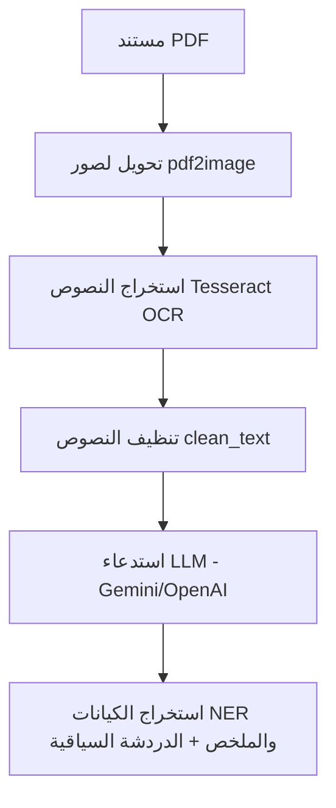
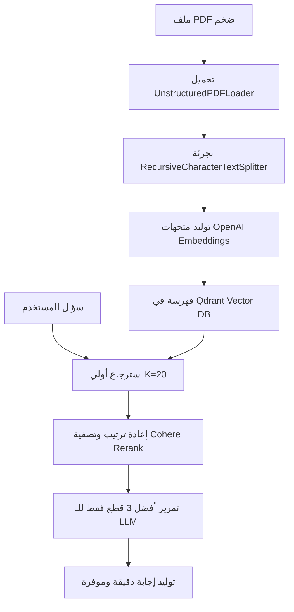

# 📄 مشروع مساعد المستندات الذكي: Document-GPT & Gemini
> **وثيقة تقنية وأكاديمية لمشروع التخرج / المناقشة الجامعية**

### 👤 إعداد وتطوير الطالب:
**مازن خالد احمد قحطان**

---

## 📌 الفكرة العامة (Introduction)
نظام ذكي متكامل يعتمد على تقنية **الجيل المسترد المدعوم (RAG)** والتعرف الضوئي على النصوص (OCR) والتعرف على الكيانات (NER)، يهدف إلى تمكين المستخدمين من رفع ملفات PDF (سواء كانت نصية أو ممسوحة ضوئياً كصور) والدردشة معها بالذكاء الاصطناعي بدقة متناهية وبدون هلوسة.

- **المشكلة:** صعوبة استخراج البيانات من ملفات PDF الممسوحة ضوئياً وتشتت النماذج اللغوية عند التعامل مع مستندات ضخمة.
- **الهدف:** أتمتة قراءة المستندات واستخلاص الكيانات الهامة وتوفير دردشة آمنة وسياقية موفرة للتكلفة.

---

## 🏗️ معمارية وهيكلية النظام (Architecture)
ينقسم النظام إلى مسارين منفصلين ومتكاملين لضمان أقصى كفاءة:

### 1. مسار واجهة المستخدم (Streamlit & OCR Pipeline)
يختص بالملفات المرفوعة مباشرة من الواجهة ويعالجها عبر الخطوات التالية:



### 2. مسار الاسترجاع المتقدم (Advanced RAG Pipeline)
يختص بالملفات الضخمة لتفادي تشتت النماذج وتقليل التكلفة المالية:



---

## 🛠️ التقنيات المستخدمة (Tech Stack)
* **Streamlit:** بناء واجهة الويب التفاعلية العصرية ديناميكياً.
* **LangChain:** الربط بين المكونات وإدارة سلاسل الـ RAG والمحادثة.
* **Qdrant:** قاعدة البيانات المتجهة (Vector DB) لحفظ الفهارس والبحث الدلالي السريع.
* **Tesseract OCR & Poppler:** استخراج النصوص من الصور والملفات الممسوحة ضوئياً.
* **OpenAI & Gemini APIs:** النماذج اللغوية الضخمة (LLMs) لفهم النصوص والإجابة.
* **Cohere Rerank:** ضغط السياق وإعادة ترتيب النتائج لرفع الدقة وتقليل استهلاك التوكنز.

---

## 🚀 المميزات الرئيسية (Key Features)
1. **استخراج الكيانات الذكي (NER):** تصنيف تلقائي للمعلومات الحساسة (شركات، تواريخ، حسابات بنكية، مبالغ).
2. **واجهة ثنائية اللغة (Bilingual UI):** دعم كامل وعصري للعربية والإنجليزية مع تطبيق اتجاهات النصوص (RTL/LTR) عبر CSS مخصص.
3. **استرجاع متطور ومحسن التكلفة:** الدمج بين Qdrant و Cohere Rerank لتحقيق أقصى دقة وأقل استهلاك للرموز.
4. **حفظ محلي مستدام:** حفظ مفاتيح الـ API والخيارات محلياً في ملف `config.json`.
5. **مراقبة برمجية لسلامة البيئة:** فحص جاهزية الأدوات الخارجية (Tesseract, Poppler) من الواجهة مباشرة.

---

## ⚙️ التشغيل والتثبيت المحلي (Setup)
### 1. تثبيت المتطلبات الخارجية (Windows):
* تثبيت **Tesseract OCR** بالمسار الافتراضي `C:\Program Files\Tesseract-OCR\tesseract.exe`.
* تثبيت **Poppler** وفك الضغط عنه في مجلد `C:\poppler`.

### 2. تثبيت مكتبات Python:
```bash
pip install -r requirements.txt
```

### 3. تشغيل واجهة الويب:
```bash
streamlit run main.py
```

### 4. تشغيل الـ Advanced RAG:
* تشغيل قاعدة بيانات Qdrant محلياً على المنفذ `6333` (عبر Docker أو تشغيل محلي).
* فتح وتشغيل دفتر التطوير المرفق `notebooks/Advance_Rag.ipynb`.